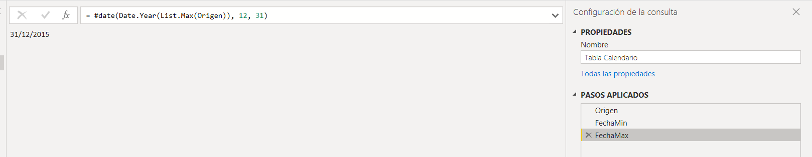

#Power BI

## Carga Datos
Se cargan a Power BI a traves de un Archivo EXCEL ambas tablas con la informacion ya limpia desde SQL.

No se realizo ninguna modificacion inmportante a las tablas cargadas, unicamente se cambio el formato a MAYUSCULAS a ciertas coluumnas
con la herramienta de Power Query

## Tabla Calendario
Se creo una tabla Calendario para poder trabajar con algunos datos de fechas, la tabla se creo utilizando lenguaje en codigo M.

```m
// Paso 1 Se toma de la Tabla Origen la columna sobre la que se calcularan las fechas.
= #"Ventas"[saledate]
```


```m
// Paso 2: Se agrega un paso extra llamado Fecha Min con la fecha deseada.
// Nota: La tabla comienza desde el año 1920 pero de esa fecha hasta 1970 la informacion no es muy relevante,
//por lo que se decide omitir.
= #date(Date.Year(List.Min(Origen)), 12, 31)
```


```m
// Paso 3: Se agrega otro paso llamado FechaMax para tomar el Año Maximo que encuentre en la tabla Animes
//y la columna fecha extreno,y le agregara los valores 12 y 31 haciendo referencia al dia 31 de Dicembre
= #date(Date.Year(List.Max(Origen)), 12, 31)
```


```m
Paso 4: Se agrega otro paso y se crea una lista desde el valor de FechaMIN hasta FechaMAX
= {Number.From(FechaMin)..Number.From(FechaMax)}
```

Paso 6: Se da a la opcion de convertir Lista a Tabla.
Paso 7: Se cambia el Tipo de Dato
Paso 8: Se agregan columnas con la herramienta de Power Query.

## Relaciones
Las tablas Vehiculos y Ventas se relacionan mediante el ID que se creo en la BD, y la columna SaleDate se relaciona con la fecha de la tabla calendario.
Se crean 2 tablas para medidas:
-  Medidas Basicas: SUM, COUNT, AVG
-  Medidas Especificas: Porcentajes, Con Filtros ETC.


## DAX
Medidas Especificas.

-  Cantidad Autos Automaticos: Medida que saca de los Autos que se vendieron, cuantso son de Transmision "Automatic". Se utilizo para visualizaciones
```DAX
Cantidad Autos Automaticos =
CALCULATE ( [Cantidad Ventas Autos], Vehiculos[transmission] = "Automatic" )
```
-  Cantidad Autos Manual:  Medida que saca de los Autos que se vendieron, cuantso son de Transmision "Manual". Se utilizo para visualizaciones
```DAX
Cantidad Autos Manual =
CALCULATE ( [Cantidad Ventas Autos], Vehiculos[transmission] = "manual" )
```
-  Cantidad Modelos Marca:  Medida que saca cuantos Autos hay por cada marca.
```DAX
Cantidad Modelos por Marca =
CALCULATE ( [Cantidad Autos], VALUES ( Vehiculos[MODEL] ) )
```
-  Cantidad Vehiculos por Año: Medida que saca cuantos Autos hay por cada Año.
```DAX
Cantidad Vehiculos por Año =
CALCULATE ( [Cantidad Autos], VALUES ( Vehiculos[year] ) )
```
-  Diferencia precio Real vs MMR: Medida que saca la diferencia entre las columnas de Precio de Venta - MMR (Precio IDEAL)
```DAX
Diferencia Precio Real vs MMR =
SUMX ( Ventas, Ventas[sellingprice] - Ventas[mmr] )
```
-  Precio Autos Automaticos: Medida que obtiene el precio promedio de venta de los Autos con Tranmision Automatica
```DAX
Precio Autos Automaticos =
CALCULATE ( [Promedio Precio Venta], Vehiculos[transmission] = "Automatic" )
```
-  Precio Promedio Autos Manuales: Medida que obtiene el precio promedio de venta de los Autos con Tranmision Manual
```DAX
Precio Promedio Autos manual =
CALCULATE ( [Promedio Precio Venta], Vehiculos[transmission] = "manual" )
```
-  Promedio Odometro KMH: Meida para convertir la cantidad de MPH del Odometro a KPH
```DAX
Promedio Odometro KMH =
[Promedio Odometro MPH] * 1.60934
```
-  Promedio Odometro KMH Automatico: Medida que obtiene la medida del Odometro en KPH para los autos de transmision Automatica
```DAX
Promedio Odometro kmh Automatico =
CALCULATE ( [Promedio Odometro KMH], Vehiculos[transmission] = "Automatic" )
```
-  Promedio Odometro KMH Manual: Medida que obtiene la medida del Odometro en KPH para los autos de transmision Manual
```DAX
Promedio Odometro kmh Manual =
CALCULATE ( [Promedio Odometro KMH], Vehiculos[transmission] = "Manual" )
```
-  Promedio Odometro MPH Automatico: Medida que obtiene la medida del Odometro en MPH para los autos de transmision Automatica
```DAX
Promedio Odometro MPH Automatico =
CALCULATE ( [Promedio Odometro MPH], Vehiculos[transmission] = "Automatic" )
```
-  Promedio Odometro MPH Manual: Medida que obtiene la medida del Odometro en MPH para los autos de transmision Manual
```DAX
Promedio Odometro MPH Manual =
CALCULATE ( [Promedio Odometro MPH], Vehiculos[transmission] = "Manual" )
```
-  Suma Odometro KPH: Suma de la columna Odometro en KPH
```DAX
Suma Odometro KPH =
SUMX ( Ventas, [Suma Odometro MPH] * 1.60934 )
```
-  % Ventas del total: Saca el porcentaje de Ventas del Total que le corresponde a cada Estado,
```DAX
% Ventas del Total =
VAR Tota_precioVenta = [Suma Precio Venta]
VAR Total_Precio_State =
    CALCULATE ( [Suma Precio Venta], ALL ( Ventas ) )
VAR Resultado =
    DIVIDE ( Tota_precioVenta, Total_Precio_State, 0 )
RETURN
    Resultado
```
-  % Total Autos Vendidos: Saca el porcentaje del total de los autos vendidos que le corresponde a cada Estado,
```DAX
% Total Autos Vendidos =
VAR Tota_precioVenta = [Cantidad Ventas Autos]
VAR Total_Precio_State =
    CALCULATE ( [Cantidad Ventas Autos], ALL ( Ventas ) )
VAR Resultado =
    DIVIDE ( Tota_precioVenta, Total_Precio_State, 0 )
RETURN
    Resultado
```
-  % Diferencia de Precios: Saca el porcentaje del Total de la diferencia de precio que le corresponde a cada Estado,
```DAX
% Diferencia Precios =
VAR Tota_precioVenta = [Diferencia Precio Real vs MMR]
VAR Total_Precio_State =
    CALCULATE ( [Diferencia Precio Real vs MMR], ALL ( Ventas ) )
VAR Resultado =
    DIVIDE ( Tota_precioVenta, Total_Precio_State, 0 )
RETURN
    Resultado
```

## Visualizaciones


